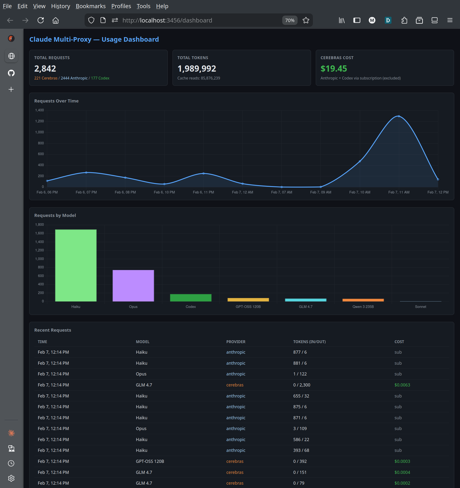

# claude-multi-proxy

A single-process proxy that routes Claude Code requests to multiple AI providers. Use your Claude Max subscription for Anthropic models while routing subagents to cheaper or free alternatives.

```
Claude Code (OAuth) --> proxy (port 3456)
  |-- Anthropic models --> api.anthropic.com (passthrough, OAuth preserved)
  |-- Cerebras models  --> api.cerebras.ai (OpenAI Chat Completions)
  |-- Codex models     --> chatgpt.com Codex API (OpenAI Responses API)
```

## Why

Claude Code is excellent but expensive. Opus 4.6 costs $15/$75 per million tokens. Most subagent work (implementation, code review, data analysis, background polling) doesn't need Opus-level intelligence.

This proxy lets you keep Opus for your main session while routing subagents to:
- **Cerebras** ($0.35-$2.75/M tokens) for fast implementation work
- **Codex** (free via ChatGPT Plus/Pro subscription) for code review, architecture, and data analysis

Token savings of 10-60x on delegated work, with zero changes to Claude Code itself.

## Setup

### Prerequisites

- Node.js 20+
- Claude Code with Claude Max subscription (OAuth auth)
- Cerebras API key (free tier available at [cerebras.ai](https://cerebras.ai))
- ChatGPT Plus/Pro subscription with Codex access (optional, for Codex routing)

### Install

```bash
git clone git@github.com:daviddawson/claude-code-multirouter.git
cd claude-code-multirouter
npm install
npm run build
```

### Configure

Create `~/.claude-code-router/config.json`:

```json
{
  "port": 3456,
  "providers": {
    "anthropic": {
      "passthrough": true
    },
    "cerebras": {
      "baseUrl": "https://api.cerebras.ai/v1/chat/completions",
      "apiKey": "YOUR_CEREBRAS_API_KEY",
      "models": ["qwen-3-235b-a22b-instruct-2507", "zai-glm-4.7", "gpt-oss-120b"]
    },
    "codex": {
      "baseUrl": "https://chatgpt.com/backend-api/codex/responses",
      "authFile": "~/.codex/auth.json",
      "models": ["gpt-5.1-codex-mini", "gpt-5.1-codex", "gpt-5.1-codex-max", "gpt-5.2-codex"]
    }
  },
  "usage": {
    "logFile": "~/.claude-code-router/usage.jsonl",
    "costs": {
      "qwen-3-235b-a22b-instruct-2507": { "input": 0.60, "output": 1.20 },
      "zai-glm-4.7": { "input": 2.25, "output": 2.75 },
      "gpt-oss-120b": { "input": 0.35, "output": 0.75 }
    }
  }
}
```

For Codex, you need an auth token from the Codex CLI. Install and authenticate:
```bash
npm install -g @openai/codex
codex --login
```
This creates `~/.codex/auth.json` which the proxy reads for OAuth tokens.

### Run

```bash
# Start the proxy
node dist/server.js

# In another terminal, launch Claude Code through the proxy
ANTHROPIC_BASE_URL=http://localhost:3456 claude
```

Or add shell helpers to your `.bashrc`:

```bash
ccr-start() {
  if ! lsof -ti :3456 >/dev/null 2>&1; then
    nohup node ~/path/to/claude-multi-proxy/dist/server.js > /tmp/claude-proxy.log 2>&1 &
    disown
    sleep 1
  fi
  echo "claude-multi-proxy ready (port 3456)"
}

ccr-stop() {
  kill $(lsof -ti :3456) 2>/dev/null
  echo "claude-multi-proxy stopped"
}

claudem() {
  ccr-start
  ANTHROPIC_BASE_URL=http://localhost:3456 claude --dangerously-skip-permissions "$@"
}
```

Then just run `claudem`.

## How Routing Works

The proxy inspects each request's system prompt for a routing tag:

```
<CCR-SUBAGENT-MODEL>provider,model</CCR-SUBAGENT-MODEL>
```

- `<CCR-SUBAGENT-MODEL>cerebras,zai-glm-4.7</CCR-SUBAGENT-MODEL>` routes to Cerebras
- `<CCR-SUBAGENT-MODEL>codex,gpt-5.1-codex</CCR-SUBAGENT-MODEL>` routes to Codex
- No tag = Anthropic passthrough (your main Opus/Sonnet session)

You place this tag in Claude Code custom agent definitions (`~/.claude/agents/*.md`). The tag is in the system prompt, invisible to the conversation.

### Agent Definition Example

```markdown
---
name: fast-dev
description: "Implementation agent using Cerebras GLM 4.7"
model: sonnet
color: green
---

<CCR-SUBAGENT-MODEL>cerebras,zai-glm-4.7</CCR-SUBAGENT-MODEL>

You are an expert implementation engineer...
```

The `model: sonnet` in the frontmatter is what Claude Code sends in the API request, but the proxy overrides routing based on the CCR tag.

## Recommended Agent Setup

### By Cost Tier

| Agent | Provider | Model | Cost (per M tokens) | Use Case |
|-------|----------|-------|---------------------|----------|
| Main session | Anthropic | Opus 4.6 | $15/$75 | Planning, coordination, complex reasoning |
| fast-dev | Cerebras | GLM 4.7 | $2.25/$2.75 | Code implementation, refactoring |
| fast-dev-gptoss | Cerebras | GPT-OSS 120B | $0.35/$0.75 | Simple tasks, background polling |
| watcher | Cerebras | GPT-OSS 120B | $0.35/$0.75 | CI/CD monitoring, deploy watching |
| code-reviewer | Codex | gpt-5.1-codex | Free (subscription) | Code review |
| software-architect | Codex | gpt-5.1-codex | Free (subscription) | Architecture analysis |
| code-reader | Codex | gpt-5.1-codex | Free (subscription) | Deep code understanding |
| data-analyst | Codex | gpt-5.1-codex | Free (subscription) | Data processing, test analysis |

### Use Cases

#### Cheap Implementation (Cerebras)

Route implementation work to Cerebras models. GLM 4.7 is a purpose-built coding model at 5-30x cheaper than Anthropic. GPT-OSS 120B is the cheapest option for simple tasks.

```
You: "implement the login form"
Opus: spawns fast-dev agent → routed to Cerebras GLM 4.7
      fast-dev writes code, Opus reviews the result
```

#### Free Code Review (Codex)

Route reviews to Codex models via your ChatGPT subscription. No per-token cost.

```
You: "review the changes"
Opus: spawns code-reviewer → routed to Codex gpt-5.1-codex
      reviewer analyzes code, returns findings to Opus
```

#### Background Observation (Cerebras GPT-OSS)

Long-running watch tasks burn tokens on repeated polling. Route them to the cheapest model in a background agent.

```
You: "push to git, watch the build, monitor the k8s deploy"
Opus: spawns watcher in background → routed to Cerebras GPT-OSS
      watcher polls for 30 minutes at $0.35/M tokens
      main session stays free for other work
      watcher returns structured summary when done
```

Without the watcher, this would be 20+ Opus turns at $15/$75 per M tokens just to repeatedly check job status.

#### Data Analysis (Codex)

JSON parsing, test result analysis, log pattern detection. Keep heavy data processing out of your main Opus context.

```
You: "analyze the comparison test results"
Opus: spawns data-analyst → routed to Codex (free)
      analyst parses JSON, categorizes failures, produces summary
      Opus receives concise findings, not raw data
```

## Format Conversion

The proxy converts between API formats transparently:

| Direction | Conversion |
|-----------|-----------|
| Claude Code --> Cerebras | Anthropic Messages API --> OpenAI Chat Completions |
| Cerebras --> Claude Code | OpenAI SSE --> Anthropic SSE |
| Claude Code --> Codex | Anthropic Messages API --> OpenAI Responses API |
| Codex --> Claude Code | Codex SSE --> Anthropic SSE |
| Claude Code --> Anthropic | Raw passthrough (zero transformation) |

Tool schemas are passed through with `strict: false` for Codex compatibility. Unsupported JSON Schema keywords (format, pattern, propertyNames, etc.) are accepted by Codex in non-strict mode.

## Usage Dashboard

Access the dashboard at `http://localhost:3456/dashboard` while the proxy is running.



Shows:
- Request counts by provider
- Token usage over time
- Cost tracking (Cerebras only, Anthropic/Codex via subscription)
- Recent request log

## Usage Logging

All requests are logged to `~/.claude-code-router/usage.jsonl`:

```json
{"timestamp":"2026-02-07T11:00:00.000Z","provider":"cerebras","model":"zai-glm-4.7","inputTokens":1200,"outputTokens":500,"cacheReadTokens":0,"cacheCreationTokens":0,"totalTokens":1700}
```

Query via the API: `curl http://localhost:3456/api/usage`

## Project Structure

```
src/
  server.ts              -- Fastify entry point
  router.ts              -- CCR tag detection, provider routing
  config.ts              -- Config loader (~/.claude-code-router/config.json)
  codex-auth.ts          -- OAuth token manager for Codex
  usage.ts               -- JSONL usage logging
  providers/
    anthropic.ts         -- Passthrough proxy (OAuth preserved)
    cerebras.ts          -- Anthropic -> OpenAI Chat Completions
    codex.ts             -- Anthropic -> OpenAI Responses API
  format/
    anthropic-to-openai.ts   -- Request converter (Cerebras)
    openai-to-anthropic.ts   -- SSE stream converter (Cerebras)
    anthropic-to-codex.ts    -- Request converter (Codex)
    codex-to-anthropic.ts    -- SSE stream converter (Codex)
dashboard.html           -- Usage dashboard (Chart.js)
```

## Limitations

- Cerebras models reject `reasoning` and `thinking` fields. The format converter strips these.
- Codex strict mode is incompatible with Claude Code's tool schemas. The proxy uses `strict: false`.
- Codex OAuth tokens expire and are auto-refreshed, but initial authentication requires the Codex CLI.
- Image content in messages is converted to data URLs for Cerebras but not supported by Codex.
- The proxy binds to localhost only. Not designed for network exposure.

## License

MIT
